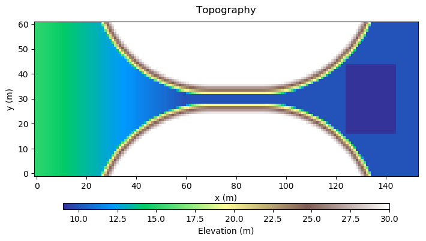
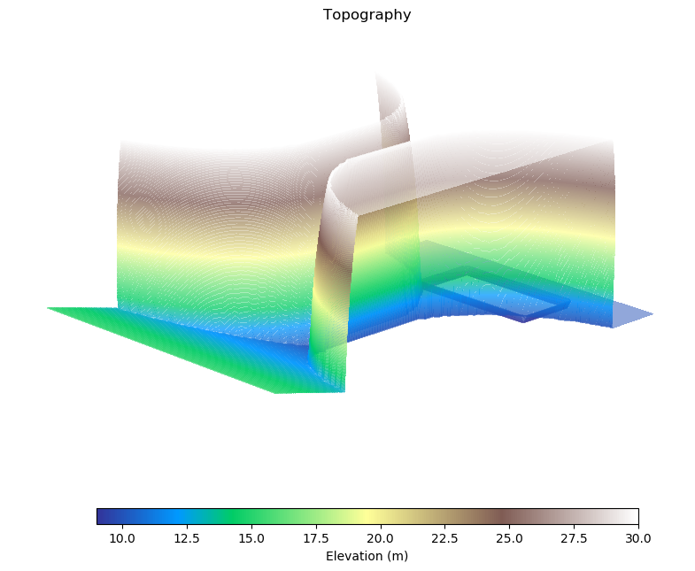
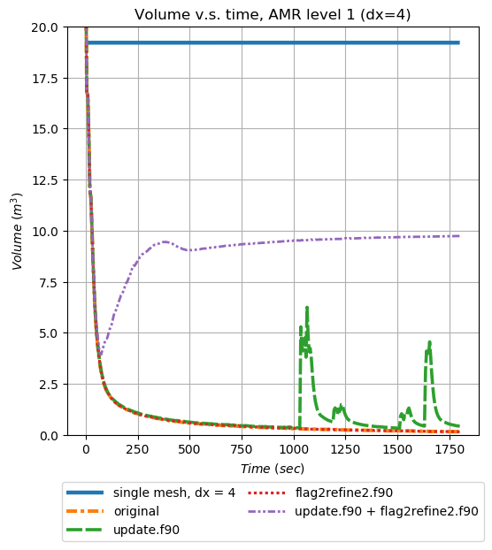
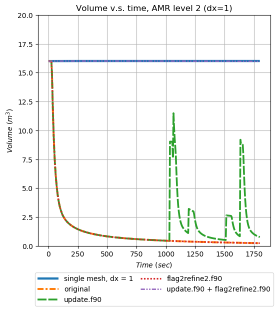

geoclaw-neck-test
=================

This repository includes all necessary components for reproducing neck-test with
GeoClaw v5.5.0. The neck-test is a set of tests to show the possible 
violation of volume conservation in GeoClaw when the base topography 
has a neck-like (or channel-like) feature.

**Content**
1. [Steps to reproduce results](#1-steps-to-reproduce-results)
2. [Input data](#2-input-data)
    1. [Topography](#21-topography)
    2. [Initial condition (I.C.)](#22-initial-condition-ic)
    3. [Other parameters](#23-other-parameters)
3. [Results](#3-results)
    1. [Using a single-level mesh for a simulation](#31-using-a-single-level-mesh-for-a-simulation)
        1. [dx = 4](#311-dx--4)
        2. [dx = 2](#312-dx--2)
        3. [dx = 1](#313-dx--1)
        4. [dx = 0.5](#314-dx--05)
        5. [dx = 0.25](#315-dx--025)
        6. [dx = 0.125](#316-dx--0125)
    2. [Using a two-level AMR mesh for a simulation (coarse grid: dx=4; fine mesh: dx=1)](#32-using-a-two-level-amr-mesh-for-a-simulation-coarse-grid-dx4-fine-mesh-dx1)
        1. [Original GeoClaw](#321-original-geoclaw)
        2. [Modified `update.f90`](#322-modified-updatef90)
        3. [Modified `flag2refine2.f90`](#323-modified-flag2refine2f90)
        4. [Modified `update.f90` + modified `flag2refine2.f90`](#324-modified-updatef90--modified-flag2refine2f90)
    3. [Conservation of fluid volumes](#33-conservation-of-fluid-volumes)
4. [Contact](#4-contact)


-----------------------------
## 1. Steps to reproduce results

To reproduce the results, follow these commands (on Linux):

```
$ python setup.py
$ python run.py
$ python totalvolume.py
$ python create_plots.py
```

The followings are the dependencies required. The versions of these dependencies 
are the ones I used. It doesn't mean other versions do not work. It's just saying 
I don't know what will happen if using different versions.

1. gfortran 8
2. python 3.6.8
3. numpy 1.15.4
4. matplotlib 3.0.2

My test environment is Arch Linux with kernel 5.0.0-arch1-1-ARCH.

----------------
## 2. Input data

### 2.1. Topography

The topography is made-up. Its spatial resolution is 1m by 1m. The inflow 
region is an inclined flat surface with an angle of 5 degrees and spans 
from x=0 to x=60m. This provides required gravity to drive the flow.
A channel with a converging entrance and a diverging exit is in the middle 
of the whole topography, beginning from approximately x=21.5m to x=138.5m. 
The width of the middle section of the channel is 3m. Part of the channel 
entrance is located in the inclined region, while its central and rear sections 
are at horizontal level. There is a pool-like feature after the exit of the 
channel. The purpose of the pool is to collect the fluid, and hence the flow 
will not touch the computational boundaries. This should eliminate the effect 
of boundary conditions.

The `setup.py` script creates the topography data. To create 2D and 3D plots 
of the topography, execute `$ python plot_topo.py` after running `setup.py`.

*2D plot of the topography*



*3D plot of the topography*



### 2.2. Initial condition (I.C.)

The initial state of the flow is at a cylinder-like shape. The cylinder is 
centered at x=20m and y=30m with a radius of 5m and a depth of 0.2m. 
Theoretically, the initial volume is about 15.708 cubic meters. However, when 
applying this I.C. to computational grids, we use a very naive algorithm: only 
the cells that have their centers enclosed by the 5m radius will have initial 
values. The consequence is that the initial volumes of the fluid depend on the 
grid resolutions and are not exactly 5 x 5 x 0.2 x pi. Given that the purpose of
this series of tests is to test the AMR capability of channel-like (neck-like)
features, it may not be necessary to improve the initial condition setup.

### 2.3. Other parameters

1. Sea level: -10.0 m
2. Dry tolerance 1e-4 m
3. Manning's friction coefficient: 0.035
4. Friction depth: 1e6 m
5. Variable dt refinement: True

----------
## 3. Results

### 3.1. Using a single-level mesh for a simulation

First, we run a series of simulations with a single-level mesh in each simulation.
The tested resolutions are dx = 4, 2, 1, 0.5, 0.25, and 0.125m. Note the 
resolution of the underlying topography is 1m. The purpose of these tests is to 
confirm that the volume is conserved when there is no AMR involved. From the 
first figure in [the subsection 3.3](#33-conservation-of-fluid-volumes), we can see 
that for all resolutions, the volumes are always constants with respect to time. 
This proves that the volume conservation issue does not happen when there is no AMR.

The followings are the flow animations of these cases. When using coarse meshes,
for example, dx=4 and dx=2, the flow patterns are somehow different from those
with finer meshes. This may because coarse meshes are more difficult 
to capture the channel-like feature, especially the channel width is only 3 
meters in this case. Nevertheless, the volumes are still conserved with respect 
to time for these coarse meshes. When the resolution reaches at least the 
topography resolution (1m in this case), the flow patterns start to agree with
each other. This is because the finer mesh can nicely capture the channel.

#### 3.1.1. dx = 4


#### 3.1.2. dx = 2


#### 3.1.3. dx = 1


#### 3.1.4. dx = 0.5


#### 3.1.5. dx = 0.25


#### 3.1.6. dx = 0.125


### 3.2. Using a two-level AMR mesh for a simulation (coarse grid: dx=4; fine mesh: dx=1)

This section shows the issue of volume conservation when we have AMR meshes.
The mesh is always a two-level AMR mesh with the coarse mesh to be dx=4 and
the fine mesh to be dx=1. Base on the result from the [single-level mesh 
simulation of dx=1m](#313-dx--1), this two-level AMR mesh is assumed to be 
good enough to capture reasonable flow patterns.

There are a total of four cases in this series. The [first 
one](#321-original-geoclaw) is running with the original GeoClaw v5.5.0. The 
[second one](#322-modified-updatef90) is running with a modified version of the 
source code `update.f90`, which is named `update_modified.f90` in the folder `src`:

```
$ diff <GeoClaw 5.5.0 src>/2d/shallow/update.f90 src/update_modified.f90
------------------------------------------------------------------------
160c160
<                             hc = min(hav, (max(etaav-bc*capac, 0.0d0)))
---
>                             hc = min(hav, (max(etaav-bc*capac, dry_tolerance)))
```

The [third one](#323-modified-flag2refine2f90) does not use the modified 
`update.f90`, but it uses a modified version of `flag2refine2.f90`, which is
named `flag2refine2_modified.f90` in the folder `src`. The modified version
of `flag2refine2.f90` simplifies the flagging process for mesh refinement: as
long as there is fluid in a cell, the cell will always be refined regardless
of whether the depth is greater or less than `dry_tolerance`.

The [last one](#324-modified-updatef90--modified-flag2refine2f90) uses both
`update_modified.f90` and `flag2refine2.f90`. And this case is the only one
giving us reasonable flow patterns and correct volume conservation behavior.

The second and the third figures in 
[the subsection 3.3](#33-conservation-of-fluid-volumes)
show the volume conservation on the coarse and the fine meshes of the two-level
AMR grid. When compared to the corresponding non-AMR single-level grid, on the
coarse mesh, none of the four cases follows volume conservation. However, on the 
fine mesh, the one with both `update_modified.f90` and `flag2refine2_modified.f90`
can perfectly match the result of the non-AMR grid. In other words, the volume on the
fine mesh of this case is conserved.

#### 3.2.1. Original GeoClaw

This case uses original GeoClaw v5.5.0 without any modification. It shows that,
even though the fine mesh has a 1m resolution, it still can't correctly produce 
reasonable flow patterns, while the non-AMR 1m mesh can. Moreover, the volume
disappears from the computational domain, cuasing the issue of volume conservation.

*Depth on the level 1 grid*


*Depth on the level 2 grid*


#### 3.2.2. Modified `update.f90`

The `update_modified.f90` modifies how the solver updates a coarse-mesh 
cell based on the values of its children. When the averaged fluid surface of the 
child cells is below the topography elevation of the parent cell, the 
`update_modified.f90` sets the fluid depth in the parent cell to `dry_tolerance`, 
while the original `update.f90` sets the depth of the parent to zero. This 
modification is done in hopes of triggering a mesh refinement to the cells
surrounding the parent cell (i.e., the buffer layer). And so a better 
topography resolution can be obtained by the solver in this region. 
Unfortunately, due to the criteria in `flag2refine2.f90`, adding `dry_tolerance` 
to the parent cell is not enough to trigger the mesh refinement to the parent's 
neighbors.

*Depth on the level 1 grid*


*Depth on the level 2 grid*


#### 3.2.3. Modified `flag2refine2.f90`

The refinement criterion is simplified so that all wet cells are flagged for 
refinement regardless of whether the depths are higher or lower than the 
`dry_tolerance`. The simulation result is still erroneous, which is expected. 
This is due to that the problematic parent cell still has a zero depth when 
using original `update.f90`. So the solver still thinks that parent cell is a dry
cell, even though this dry parent cell actually has wet child cells. And the 
solver does not flag this parent cell for refinement, and therefore its neighbor
cells (the buffer layer) will not be refined.

*Depth on the level 1 grid*


*Depth on the level 2 grid*


#### 3.2.4. Modified `update.f90` + modified `flag2refine2.f90`

After using both `update_modified.f90` and `flag2refine2_modified.f90`, whenever
a parent cell has any number of wet child cells, it's always identified as a wet 
cell, and the solver always flags such a cell for refinement. The case produces
expected results.

*Depth on the level 1 grid*


*Depth on the level 2 grid*


### 3.3. Conservation of fluid volumes

This section shows that with single-level meshes (i.e., non-AMR meshes), the
volumes are always conserved. But with two-level AMR, only the [fourth 
case](#324-modified-updatef90--modified-flag2refine2f90) conserves the volume on
the fine mesh, while others don't. And on the coarse mesh, all cases do not 
conserve the volume.

*Volume conservation of the single-level mesh cases*


*Volume conservation of the two-level AMR mesh cases: level 1*



*Volume conservation of the two-level AMR mesh cases: level 2*



----------
## 4. Contact

Pi-Yueh Chuang pychuang@gwu.edu
